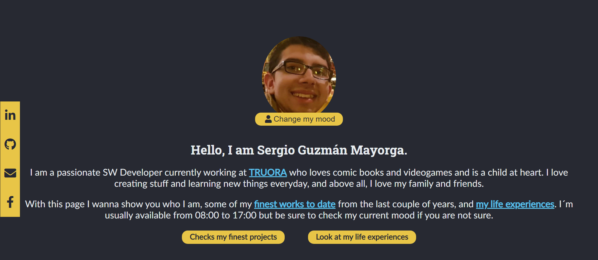

# Web page: I am Sergio Guzmán

"I am Sergio Guzmán" is a webpage project to showcase my software development experience and what I love about life. It has my work experience, hobbies, skills, contact information and previous projects.

## Goal and technologies

The aim for this project is to show employees and work partners (previous, current and/or future) what I have done and what are my skills in software development. For this, I create a web project with Vue JS as a framework, including VueX (State management), Vue Composition API (lifecycles) and Vue Router. 

As a cool feature, depending on the current hour of your browser you will see a different design for the webpage. You can also change this with the "Change moods" functionality close to the profile picture (Handling of CSS vars). 

Finally for animations I used vue-animate-scroll and CSS trnasitions.

## How to run

The new version for I Am Sergio Guzman includes a backend made with ktor (Kotlin coroutines-based framework), so there are two steps to run this project locally: 

### Backend
For this to work you need to have java and kotlin installed in your machine, please check if these commands work:
```
java -version
kotlin -version
```

If they don't please check how to install kotlin with the [official docs](https://kotlinlang.org/docs/tutorials/command-line.html) or if you´re a Windows user, [this awesome guide](https://downlinko.com/download-install-kotlin-windows.html)

Now then, go to the backend folder and build the gradle project with:
```
gradle build
```

If it doesn´t work check how to install gradle [here](https://gradle.org/install/)

And finally run the file located in **Application.kt**. TO make things easier you can always use [IntelliJ IDEA](https://kotlinlang.org/docs/tutorials/getting-started.html) to automate the entire process.

### Frontend

```
npm install
```

And then you are ready to go with a regular production serve: 

```
npm run serve
```

Or with a hot reload on staging:
```
npm run serve:staging
```

Finally for building it to deploy on a static server use:
```
npm run build
```

This will generate a dist/ folder for you to upload to any static server and automatically copy these files to a public folder on the backend directory to deploy. With Heroku I´m using the following commands to deploy directly to the server: 

***Normal push***
```
git subtree push --prefix backend heroku master
```

***Force push***
```
git subtree split --prefix master backend
git push heroku <GENERATED ID>:master --force
```


## Authors

- Sergio Guzmán Mayorga: https://github.com/sguzmanm

## Collaborators

### Lina Ruiz: For the coolest logo ever
- LinkedIn: https://www.linkedin.com/in/lina-marcela-ruiz-mayorga-5b4827192


## Project

- I am Sergio Guzmán: https://github.com/sguzmanm/i-am-sergio-guzman

## Screenshots

### Home





## MIT License

This project is public with the "MIT License", which you can find here: https://github.com/sguzmanm/i-am-sergio-guzman/blob/master/LICENSE


