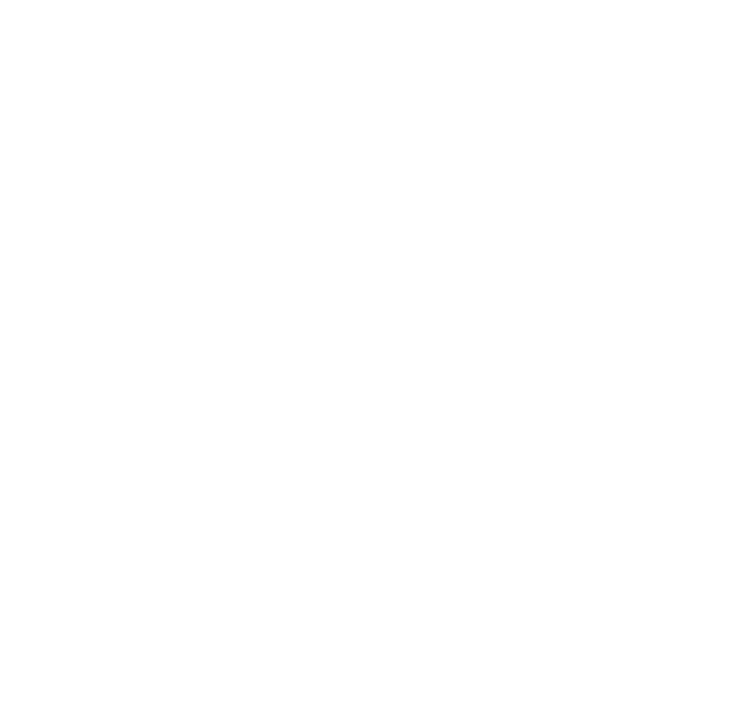
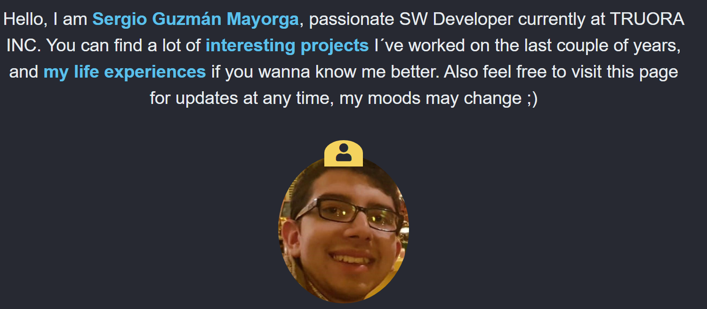

# Web page: I am Sergio Guzmán

"I am Sergio Guzmán" is a webpage project to showcase my software development experience and what I love about life. It has my work experience, hobbies, skills, contact information and previous projects.

## Goal and technologies

The aim for this project is to show employees and work partners (previous, current and/or future) what I have done and what are my skills in software development. For this, I create a web project with Vue JS as a framework, including VueX (State management), Vue Composition API (lifecycles) and Vue Router. 

As a cool feature, depending on the current hour of your browser you will see a different design for the webpage. You can also change this with the @Change moods@ functionality close to the profile picture (Handling of CSS vars). 

## How to run

First of all install it
```
npm install
```

And then you are ready to go with a regular production serve: 

```
npm run serve
```

Or with a hot reload on staging:
```
npm run serve:staging
```

Finally for building it to deploy on a static server use:
```
npm run build
```

This will generate a dist/ folder for you to upload to any static server. In here I used a CI with Heroku so that everytime there is a successful deploy on master the webpage is updated.


## Authors

- Sergio Guzmán Mayorga: https://github.com/sguzmanm

## Colaborators

### Lina Ruiz: For the coolest logo ever
- LinkedIn: https://www.linkedin.com/in/lina-marcela-ruiz-mayorga-5b4827192



## Project

- I am Sergio Guzmán: https://github.com/sguzmanm/i-am-sergio-guzman

## Screenshots

### Home




## MIT License

This project is public with the "MIT License", which you can find here: https://github.com/sguzmanm/i-am-sergio-guzman/blob/master/LICENSE


