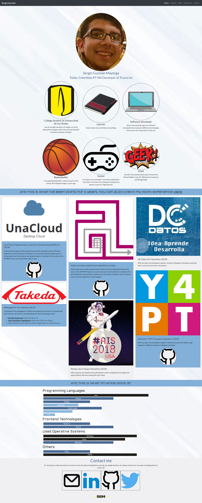
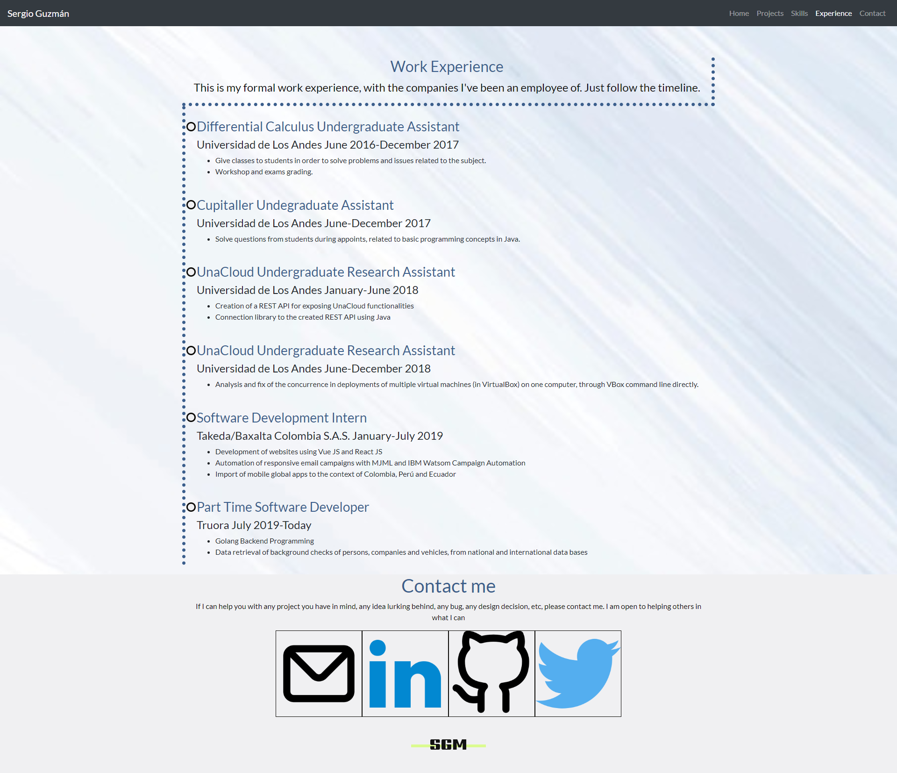

# Web page: I am Sergio Guzmán

"I am Sergio Guzmán" is a webpage project for the Web Development class @ Uniandes (Fall 2019), to showcase my skills as a software developer to anyone that is interested. It has my work experience, hobbies, skills, contact information and previous projects.

## Goal and technologies

The aim for this project is to show employees and work partners (previous, current and/or future) what I have done and what are my skills in software development. In order to accomplish this, I created a static webpage using standard web technologies (HTML5,CSS3 and vanilla JS) and Bootstrap. Bootstrap helps with the responsiveness of the website with its 12 column grid and adaptable navigation bar.

## How to run

Since it is a static webpage you can either:

- Open the index.html file on your browser of choice (Mozilla firefox for this particular project).
- Run a local server (http-server,lite-server,reload,etc).
- Deploy in a public/private server (Web Server for Chrome, Firebase, Github pages, etc).

I personally tested this page using "reload". Make sure you have npm setup and type this on a terminal to install "reload":

```
npm install -g reload
```

When its finished, go to the project root and type:

```
reload
```

### Linting

You can also check the linting of the project. By default I used eslint. To install it type at the root of the project:

```
npm install
```

And later

```
./node_modules/.bin/eslint js/
```

## Authors

- Sergio Guzmán Mayorga: https://github.com/sguzmanm

## Project

- I am Sergio Guzmán: https://github.com/sguzmanm/i-am-sergio-guzman

## Screenshots

### Home



### Experience



## MIT License

This project is public with the "MIT License", which you can find here: https://github.com/sguzmanm/i-am-sergio-guzman/blob/master/LICENSE
